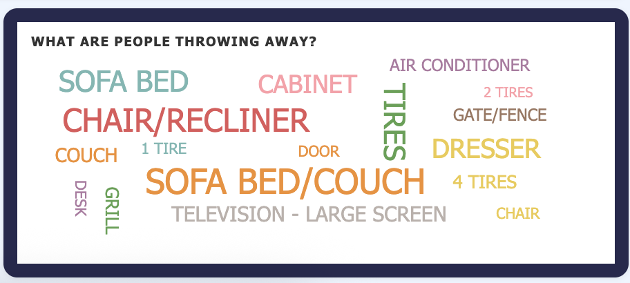

# [Who You Gonna Call? 3-1-1!](https://who-you-going-to-call-311-tras.vercel.app/)

There's data portal by Cincinnati, Ohio where you can access a variety of data about the city (all data here: https://data.cincinnati-oh.gov/.). This includes non-emergency service requests for incidents such as graffiti, bike rack damage, and littering. This project utilizes that data to create an interactive dashboard displaying the data analytics for non-emergency service requests, specifically littering, dumping, dead trees, dead animals, and potholes. The dashboard is a web browser that was made using D3.js - "a popular, open-source JavaScript library used to create custom, interactive data visualizations in web browsers". Ultimately the purpose of this dashboard is to study and provide insight on the data surrounding the incidents that were focused on.

### DEMO https://youtu.be/x6kx6qiMONI

https://github.com/user-attachments/assets/49a378fb-8c2a-43f7-8422-d94b19de1035

### **How to Run**

> 1.  Clone the repository.
> 2.  Launch a local web server in the root directory (e.g., `python -m http.server 8000`).
> 3.  Navigate to `http://localhost:8000` via web browser.

## 2. The Data

The data used was exported from the **Cincinnati 311 (Non-Emergency) Service Requests** dataset ([Cincinnati Open Data Portal](https://data.cincinnati-oh.gov/efficient-service-delivery/Cincinnati-311-Non-Emergency-Service-Requests/gcej-gmiw/about_data)). There are 70 columns and 152816 rows. It is 81.6 mb. Due to it's large size we had to narrow the scope of our data to one year and focused only on five service request types: littering, dumping, dead trees, dead animals, and potholes.

We also only focused on 9 of the 70 columns:

1. SR_TYPE (Potholes (`PTHOLE`, `POTHPARK`), Littering (`LITR-PRV`), Dead Trees (`TREEPR`), Dead Animals (`DAPUB1`), and Dumping (`DUMP-PVS`))
2. PRIORITY (STANDARD, PRIORITY, HAZARDOUS, EMERGENCY)
3. DEPT_NAME
4. METHOD_RECEIVED
5. NEIGHBORHOOD
6. TIME_RECEIVED
7. DATE_CREATED
8. PLANNED_COMPLETION_DAYS
9. DATE_CLOSED

## 3. Sketch

Diseregarding all the interactions for the maps, we have 7 different kinds of graphs that we needed to layout: leaflet, chloropleth, timeline/line chart, lollipop graph, donut chart, word cloud, and a bar chart. The following is our sketch on the initial design/layout for our dashboard:


In the end the timeline was switched with row two and heatmap was added as an option to view in the leaflet map.

## 4. Visualization Components

Our dashboard utilizes eight different graphs/maps to display our sourced data: leaflet map, chloropleth, timeline/line chart, heatmap, lollipop, bar chart, and a word cloud. Users can interact and make changes to focus or filter the data they are looking at using the global controls and KPIs. All the visuals are linked with each other and will change according to what is being highlighted. The video below demonstrates a bit of that.

https://github.com/user-attachments/assets/536ae59d-028d-4617-8263-41da4e2e7321 

### 4.1 Global Controls & KPIs

#### **Header Filters** 
Users can instantly swap the thematic color encoding, change Map Tile basemaps (e.g., Esri Topo, CartoDB Dark) for contrast, and toggle the heatmap.


#### **Dynamic KPI Strip:** 
Displays exact top-level metrics for Total Requests, Average Response Days, and Total Neighborhoods impacted.


 
#### **Data Toggles:** 
A checkbox array allows users to mix and match multiple 311 categories to uncover cross-correlations (e.g., are areas with high illegal dumping also areas with high littering?).


### 4.2 Leaflet Point Map 
This is an interactive web map created with the Leaflet Javascript library (https://leafletjs.com/). Located in the top left corner, it shows service requests mapped across Cincinnati. Users can zoom in and out on the map to an extent using the scrollwheel or through the plus/minus button. They can also drag around the map. There are five different ways to view the point distributions that can be toggled through the global controls. By default, all possible types of service are shown and are viewed on the point distribution with different colors dedicated to different requests. The default is shown below:


The default colors for the service types were chosen to be distinct and bright to be able to easily spot each service in the clusters. Green for tree dumping for the general green foliage of trees. Blue for the potholes for wanting it to be standardly addressed. The color for the trash services were simply chosen because they stood out of the chosen colors and to be unappetizing. These colors can be customized with a web color clicker by clicking the service/color of what you want to change in the legend.

Below are the other ways the point distribution can be viewed:

<table>
  <tr>
    <td>
       <figure>
          
          <figcaption>Service requests colored by priority</figcaption>
       </figure>
    </td>
    <td>
       <figure>
          
          <figcaption>Service requests colored by response time</figcaption>
       </figure>
    </td>
  </tr>

  <tr>
    <td>
       <figure>
          
          <figcaption>Service requests by neighborhood</figcaption>
       </figure>
    </td>
    <td>
       <figure>
          
          <figcaption>Service request colored by agency responsible</figcaption>
       </figure>
    </td>
  </tr>
</table>

When brush is selected, the user can highlight parts of the map. This brush will reset and be selected once the brush button in the global controls is selected again. This is demo-ed in the below video:

https://github.com/user-attachments/assets/1b07405a-b230-49f8-9ddd-bd853cc1884c

#### 4.2.1 Color Schemes

1. **Priority Field:**
   - **Type:** Ordinal Data
   - **Scheme Used:** Monochromatic/Sequential (Light Tan → Dark Orange/Brown: `#eee1cd` to `#8b4300`).
   - **Why?** Because priority has an inherent rank/order (Standard < Priority < Hazardous < Emergency), a sequential increase in color intensity naturally encodes higher importance or severity.
     


2. **Response Time Field:**
   - **Type:** Quantitative (Continuous) Data
   - **Scheme Used:** Diverging (Green → Yellow → Red: `#2b9e3e` to `#7b0d1e`).
   - **Why?** Shorter response times are positive (green) and strictly longer response times become problematic (red). A diverging palette perfectly captures this transition from a neutral state (yellow) into either a positive or negative extreme.
     


3. **Service Type, Neighborhood & Agency Fields:**
   - **Type:** Nominal (Categorical) Data
   - **Scheme Used:** Categorical Palette (`d3.schemeTableau10` and `d3.schemeSet2`).
   - **Why?** There is no numeric value or inherent order between different service types, neighborhoods or agencies. A qualitative scheme with highly distinct, contrasting colors was used so viewers can differentiate categories without implicitly assigning more weight to one over another.

### 4.3 Heatmap

When the heatmap is toggled with the 'Show Heatmap' button in the top right. The user can no longer "brush" the map until it the heatmap is deselected. This mode displays hotspots on the map for service requests by number of requests through a warm gradient. It shares all the same interactive features as the leaflets just not the brush.


### 4.4 Chloropleth Map

Like the heat map, this maps out the absolute counts of requests aggregated by Cincinnati neighborhoods ("Hottest neighborhoods") and is colored the same.
- **Color Justification (Monochromatic Sequential):** We used a quantitative, sequential yellow-orange-red color scale (`d3.interpolateYlOrRd`).Since request counts represent quantitative data scaling from low to high magnitudes, a sequential map correctly allows viewers to intuitively associate darker, more intense red shades with higher volumes of requests.


### 4.5 Timeline Area Chart

A scrubber-enabled area chart across the middle spanning all of 2022. Users can brush a specific temporal window (e.g., Spring months) which instantly updates the map, KPIs, and attribute charts.


### 4.6 Attribute Views (Lollipop, Bar, Donut, and Word Cloud Charts)
Except for the word cloud, these charts are indirectly interactive by either highlighting the leaflet maps or the timeline. They are otherwise static.

#### **Method Received (Lollipop Chart):** Shows the count of requests by intake method (e.g., App, Call).


#### **Priority (Bar Chart):** Shows how many requests fall under Standard vs. Emergency, etc.


#### **Department (Donut Chart):** Shows the proportionate breakdown of responding city departments.


#### **Illegal Dumping Profiler (Word Cloud):** Parses description texts of bulky items thrown away on the streets. Font size correlates to the frequency of the word mentioned. **Why?** Unstructured textual data (like descriptions of dumped garbage) is nominal. Mapping the frequency to size in a compact area allows users to immediately grasp the most common culprits (e.g., "mattress", "couch", "tire").



## 5. Discoveries

### 5.1 **Service Request Spike?**
There was a spike in requests overall at the end of February.


However, this was mostly due to potholes. Dead animals and dead trees did not contribute as much:


There was a bit of service requests for littering, but it's difficult to how much it correlates with potholes:


### 5.2 **Biggiest offendors for trash?**
  
  - **Finding:** Observing the Word Cloud instantly reveals that furniture and auto-parts are the primary issue. Words like "Mattress", "Tire", and "Couch" dominate the visualization, indicating that the city should potentially focus sanitation efforts on bulk-item pickup allowances for residents.

## 6. Libraries & Other Tools

D3.js (v6) for data aggregation and chart rendering, Leaflet.js for mapping, Leaflet.heat for heatmap generation, d3-cloud for the Word Cloud, and standard HTML/CSS/JS for DOM manipulation.

## 7. Code Structure

We kept things modular by having each chart have its own file so everyone was able to work on their levels independently without much conflict. Here's how the project is laid out:

```
├── index.html                 # Main page layout (flex/grid)
├── preprocess_data.py         # Python script we used to clean and filter the raw data
├── requirements.txt           # Python dependencies
├── css/
│   ├── style.css              # All the dashboard styling
│   └── leaflet.css            # Styles for the Leaflet map
├── js/
│   ├── main.js                # Loads data, wires up brushing & KPI updates
│   ├── leafletMap.js          # Point map with brushing and color toggles
│   ├── choroplethMap.js       # Neighborhood choropleth (request counts by area)
│   ├── potholeMap.js          # Pothole-specific map view
│   ├── timelineChart.js       # Brushable timeline area chart
│   ├── barchartPriority.js    # Priority bar chart
│   ├── lollipopChart.js       # Method-received lollipop chart
│   ├── donutChart.js          # Department breakdown donut chart
│   ├── wordCloud.js           # Word cloud for illegal dumping descriptions
│   ├── d3.v6.min.js           # D3.js v6 library
│   ├── d3.layout.cloud.js     # D3 word cloud layout plugin
│   ├── leaflet.js             # Leaflet.js library
│   └── leaflet-heat.js        # Leaflet heatmap plugin
├── data/
│   ├── cincinnati_311_2022_cleaned.csv  # Cleaned 311 data for 2022
│   └── cincinnati.geojson               # Cincinnati neighborhood boundaries
└── images/                    # Map marker and layer icons
```

Each visualization lives in its own class file and follows the standard D3 update pattern (enter, update, exit). `main.js` ties everything by handling data loading, filtering by the checkboxes, and making sure that when you brush on one chart, all the others update accordingly.

## 7. Challenges and Future Work

**Challenges:** Integrating mutual, multi-chart brushing logic alongside the new checkbox-based data filtering system was difficult. When users toggled an entirely new dataset (like switching from potholes to dumping), ensuring that the maps and word cloud correctly refreshed their bounds and domains without throwing D3 transition errors took significant debugging. There is also notable lag. There's a spike after changing colors for service type.

**Future Work:** With more time, we would add more service types, implement map cluster-grouping to prevent point-overlap density issues on the Leaflet map at high zoom levels. Expanding the dataset to include an entire decade (rather than just 2022) would also allow year-over-year seasonal comparisons in the timeline. Normalizing data would be a good add-on as correlation was difficult to perceive due to the difference in the amount of service requests between the types of service.

## 8. Use of AI and Collaboration

AI(Gemini inside VSCode) was used by Quoc Huynh (kiq2908) to set up outline of the documentation. Github Copilot was utilized for debugging. Claude Code was used by Dylan and Kaleab for boilerplate generation and debugging.

## 9. Who Did What

- **Quoc Huynh [kiq2908]:** Handled data pre-processing using Python to filter out only 2022 dataset and in charge of the Heatmap.
- **Tyler Brunelle [tybrun]:** Worked on the timeline and merging all graphs into one dashboard and linking interactions/filters.
- **Dylan Francis [dylfrancis]:** Handled the base map and its interactions and the brushing of the map and visualization updates.
- **Joey Yong [YomNom]:** Handled viewing data and the control panel for the different service types. This includes the checkbox data selection and custom legend color selection. She also took care of the bar chart showing the priority of the displayed services.
- **Kaleab Alemu [kaleabtesfayes]:** Worked on the choropleth map (requests by neighborhood), lollipop chart (requests by submission method), and donut chart (requests by department). Also built the word cloud of the most frequently reported bulky waste items (lvl8), and redesigned the overall dashboard layout.
